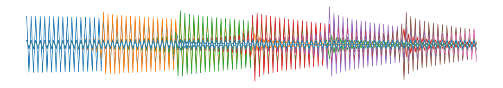

# Toolbox for Audio Event Recognition Using Deep Learning Solutions

<h1 align="center">

</h1><br>


## Contents

1. [Description](#Description)
2. [Download](#Download)
3. [Installation](#Installation)
4. [Modules Description](#Modules-Description)
5. [Example of Use](#Example-of-Use)
<!--6. [Troubleshooting](#Troubleshooting)-->


## Description
The **Audio Event Recognition** (AER) package is a Deep Learning-oriented toolbox that provides Torch-based models for characterizing, recognizing and classifying events of interest in audio streams.

In particular, it reimplements flexible and adaptive versions of 
[SincNet](https://github.com/mravanelli/SincNet)
and
[DENet](https://github.com/MiviaLab/DENet),
two deep models for sound classification in audio streams.

The main dataset used for evaluation (training & testing) was the public 
[MIVIA Audio Events Dataset](https://mivia.unisa.it/datasets/audio-analysis/mivia-audio-events/)
from the University of Salerno's
[MIVIA Lab](https://mivia.unisa.it/).
A sample of this dataset is featured in the `datasets` module for illustration and is invoked in examples in the function descriptions that may require it. The `datasets`'s `mivia_loader` module provides tools to load the data from this specific dataset.

The package also provides tools for data handling (normalization, parsing, etc.), dynamic characterization (filters & spectrogram), model evaluation (e.g. confusion matrix), signal and result visualization (e.g. plots or bar charts), etc. In particular, the `data_tk` module provides functions to parse an audio stream into *chunks* or *sequences of chunks*, a standard step in any audio signal processing.

In addition, this package provides wrapping functions to ease the export of Torch models to ONNX graphs, and load and use such graphs with the `onnxruntime` package for inference.

It also wraps functions to use the 
[Aidge](https://www.deepgreen.ai/la-plateforme)
framework for loading an ONNX graph, manipulate it and export the model to C++ sources. Note that the Aidge modules must be installed separately from this project; see this
[page](https://eclipse.dev/aidge/source/GetStarted/index.html)
for the details.

### Authors & Support
The project was developed at the Commissariat à l'Énergie Atomique et aux Énergies Alternatives (CEA) Institute, and is authored by:

- Dylan MOLINIE (main developer)
- Andréa MACARIO BARROS (supervision)

Contact Dylan MOLINIE (<dylan.molinie@gmx.fr>) for any query or support.

### Funding
This toolbox was part of the work developed for and delivered to the
[DeepGreen](https://deepgreen.ai/)
project from the Agence Nationale de la Recherche's France 2030 Research and Innovation Program (grant agreement No.23-DEGR-0001); this project focused on the energy-efficient embedded Artificial Intelligence based on Deep Learning approaches.

### License
The project is distributed under GPLv3 license.


## Download

To download the project, either go to the project page:  
https://github.com/dmolinie/aer.git

Or download it directly with the following command:

```bash
git clone https://github.com/dmolinie/aer.git
```


## Installation
To install the `aer` package, run the following command when in the package root folder:

```bash
pip install .
```

See the
[INSTALL.rst](INSTALL.rst)
file for further explanation on the requirements and options on installation.


## Modules Description
The different modules of the package are briefly described below. All the functions of every module with a short description for each of them are listed in the 
[MODULES.rst](MODULES.rst)
file.

* `accuracy`  
    Tools to build confusion matrices, compute accuracy scores (True/False Positives/Negatives) and some statistics on the classification issued by a model.

* `aidge`  
    Wrapper for the Aidge functions & tools, allowing to load an ONNX graph, manipulate it using the Aidge tools and export it into C++ sources. Requires Aidge to be installed on the system.

* `datasets`  
    Dataset loader. For now, only a loader for the MIVIA dataset is available. Also, provides examples of sound files for testing purpose.

* `data_tk`  
    Functions to manipulate data, in particular to normalize/denormalize them, to pad them and to parse a signal into chunks or sequence of chunks. Also, provides simple windowing functions.

* `display`  
    Functions to display a signal directly; the functions typically instantiate a figure and plot the data passed to them as arguments; many optional parameters allow to adjust the figure dynamically.

* `filters`  
    Simple time- and frequency-domain filters (rectangular, triangular, Gamma). Also, provides the FilterBank class that allows to build a bank of filters based on implemented filters.

* `gui`  
    Simple Graphical User Interface that can be used to dynamically display a signal and the classes outputted on its chunks by a Torch model.

* `layers`  
    Additional custom Torch layers. In particular, wraps several Torch functions into layers (`modules`) that can be used inside larger models.

* `models`  
    Provides the SincNet & DENet models, plus a simpler standard layers-only variant of it (i.e. using no custom layer), essentially consisting of the same architecture than SincNet, but in which SincLayer is replaced with a standard Convolution layer. The models accept both chunks and sequences of chunks as inputs.

* `models_tk`  
    Tools to semi-automatize the training & testing of the models, by providing functions that automatically read and load the data from a set of datasets, parse them into chunks or sequences of chunks and pass them to the models for training or testing (loss & accuracy).

* `onnx`  
    Tools to export Torch models to ONNX computation graphs (using the `torch` & `onnx` modules), and to operate inference with the `onnxruntime` Python module.

* `plot`  
    Functions that wrap the main statements of any plot; in particular, given a figure, these functions allow to plot data passed as arguments and decorate the figure (labels, titles, etc.). These functions are useful to swiftly plot data without paying attention to the main plotting functions (e.g. bar charts) and alleviate scripts.

* `spectrum`  
    Classes allowing to build the Spectrum and Cepstrum of a signal, plus the Short-Time Fourier Transform (STFT) that is used to build the spectrogram of a signal.

* `tools`  
    Simple I/O tools, data format checkers, etc.


## Example of Use
Here is a an example of use of the main functionalities of the `aer` package: it shows how to load and parse the example data from the MIVIA AE dataset (and any MIVIA AE data files more broadly), how to instantiate a SincNet model, to train it on the example data and to use it for evaluation (both loss and classification accuracy).

More detailed examples are provided in the `scripts` folder of the package sources.

```python
import numpy as np
import torch

import aer.datasets as sets
from aer.models import SincNet
import aer.models_tk as mtk
import aer.accuracy as acc
import aer.display as disp

# Set Torch default data format & device
torch.set_default_dtype(torch.float32)
DEVICE = torch.device('cuda' if torch.cuda.is_available() else 'cpu')
print("Using Torch", DEVICE)

# Display the MIVIA classes
print("MIVIA classes:", list(sets.mivia_loader.CATEGORIES.values()))
CLASSES = ['BGND', 'Glass', 'Shot', 'Scream', 'Mean']

# Use sequences of chunks or simple chunks
SEQUENCES = False


#---------------------------   Load & Set Data   ----------------------------#
# Path to the AER example XML & WAV files
ROOT = f'{sets.__path__[0]}/MIVIA_AE_example/training/'
XMLFOLDER = ROOT                                        # Events XML files folder
SNDFOLDER = ROOT + 'sounds/'                            # Audio WAV files folder

# Dataset index and SNR (only available one in the example training set)
IND, SNR = 66, 15

# Number of possible classes
NB_CLASSES = len(sets.mivia_loader.CATEGORIES)          # 4 for MIVIA AE

# Chunk & Sequences parameters
frm_duration = 100e-3                                   # Frame duration in seconds
hop_duration = 100e-3                                   # Hop duration in seconds
chk_params = (frm_duration, frm_duration)
seq_params = (10, 1)

# Load the data and build the chunks
if not SEQUENCES:
    specs, data, classes = sets.mivia_loader.build_dataset(
        (XMLFOLDER, SNDFOLDER), (IND, SNR), NB_CLASSES, chk_params)
# Or build the sequences of chunks
else:
    specs, data, classes = sets.mivia_loader.build_dataset(
        (XMLFOLDER, SNDFOLDER), (IND, SNR), NB_CLASSES, chk_params, seq_params)

# Convert the numpy arrays into torch tensors
tensors = torch.Tensor(data).unsqueeze(1).to(DEVICE)    # 1 channel for SincNet
labels = torch.Tensor(classes).to(DEVICE)

# Retrieve the shape of the input from the data
input_shape = tensors.shape[1:]                         # Data format: NC(H)W

# Build a Torch dataset
dataset = mtk.torch_dataset(tensors, labels,
    batch_size=4, drop_last=True, shuffle=True)
#----------------------------------------------------------------------------#

#---------------------------   Configure Model   ----------------------------#
# Set the recurrent cell, if any ('NoRec', 'LSTM', 'GRU')
RECURRENT = 'NoRec'

# Convolutional, Recurrent (if any) and Linear layers
CV_PARAMS = {
    'out_channels': 40, 'kernel_size': 5, 'stride': 1, 'padding': 'valid'}
CONV_PARAMS = (3, CV_PARAMS)        # 3 conv. layers with the same parameters
NB_NEURONS_FC = [2048, 1024, 512]   # 3 FC layers with 2048, 1024 & 512 neurons
NB_NEURONS_REC = 1024               # Used only if 'RECURRENT' is 'LSTM' or 'GRU'

# Regularization layers
REG_CONV = (3, 0.1)                 # Regularization after each conv. layer
REG_LINEAR = 0.1                    # Regularization after each FC layer

# Set the parameters for SincLayer
SCL_PARAMS = {'nb_filters': 40, 'filter_length': 251, 'padding': 'valid',
              'frate': specs[0], 'bandwidth': (50., specs[0]/2)}
REG_SCL = (3, 0.1)                  # Regularization after SincLayer

# Define the model
model = SincNet(
    input_shape, NB_CLASSES,
    scl_params=SCL_PARAMS, reg_scl=REG_SCL,
    conv_params=CONV_PARAMS, reg_conv=REG_CONV,
    nb_neurons_fc=NB_NEURONS_FC, reg_linear=REG_LINEAR,
    rec_cell=RECURRENT, nb_neurons_rec=NB_NEURONS_REC)
model.to(DEVICE)

# Define the Loss function
loss_fct = torch.nn.MSELoss()

# Set the optimizer to use for model training
optimizer = torch.optim.Adam(model.parameters(), lr=0.001)
#----------------------------------------------------------------------------#

#------------------------   Train & Use the Model   -------------------------#
# Evaluate the classification accuracy on the example dataset
loss = mtk.train_model([dataset], model, loss_fct, optimizer, epochs=2)

# Evaluate the model loss on the example dataset
losses = mtk.test_model_loss([dataset], model, loss_fct)

# Evaluate the classification accuracy on the example dataset
matrix = mtk.test_model_accuracy(
    [dataset, dataset], model, conf_mat=True, sequences=SEQUENCES)

# Classification indicators (TPs, FPs, FNs & TNs) from confusion matrix
hits = [acc.conf_mat_to_acc_items(mat, zeros_ones=True) for mat in matrix]

# Compute the average number of TPs for each class
# N.B.: the mean for every class are added as the last row
avgs = acc.compute_avgs(hits, 'TP', '1s_ref', mean=True).round(3)

# Plot the average number of TPs for each class
fig = disp.plot_hits(avgs,
    rtexts=CLASSES,
    fig_params={'constrained_layout': True},
    bar_params={'mean': True},
    rtext_params={'stacked': False})
fig.show()
#----------------------------------------------------------------------------#
```


<!--## Troubleshooting-->

<!--### `TypeError: can't convert cuda:0 device type tensor to numpy`-->

<!--**Symptom**-->

<!--When running `test_model_accuracy()` (or any function internally calling `.numpy()` on a tensor) with a CUDA-enabled GPU, the following error is raised:-->

<!--```-->
<!--TypeError: can't convert cuda:0 device type tensor to numpy.-->
<!--Use Tensor.cpu() to copy the tensor to host memory first.-->
<!--```-->

<!--**Cause**-->

<!--NumPy cannot operate on tensors that reside in GPU memory. Any `.numpy()` call must be preceded by `.cpu()` to first copy the tensor back to CPU memory.-->

<!--**Fix**-->

<!--In `aer/models_tk/_models_tk.py`, locate the line and add `.cpu()` before each `.numpy()` call:-->

<!--```python-->
<!--# Before (broken on CUDA)-->
<!--items += fct_acc(cls_est.numpy(), cls_ref.numpy(), conf_mat)-->

<!--# After (works on CUDA, to be tested on CPU)-->
<!--items += fct_acc(cls_est.cpu().numpy(), cls_ref.cpu().numpy(), conf_mat)-->
<!--```-->

